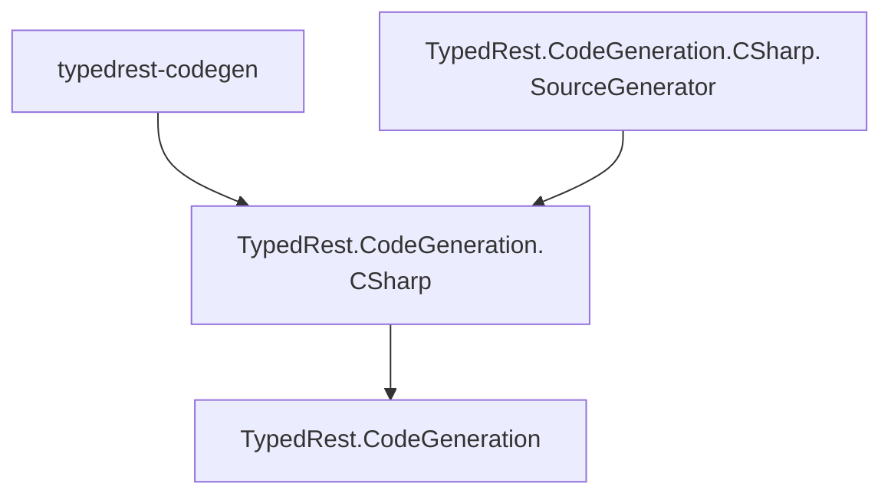

# TypedRest Code Generation

This website documents the API of the TypedRest Code Generation libraries. Use them to build your own tools that infer [TypedRest Endpoints](https://typedrest.net/endpoints/) from patterns in OpenAPI/Swagger documents and generate client source code.

If you just want to generate a client for your API, use the [source generator](https://typedrest.net/code-generation/source-generator/) or the [command-line tool](https://typedrest.net/code-generation/cli/) instead. Both are built on these libraries.

```csharp
var reader = new OpenApiStreamReader(new OpenApiReaderSettings().AddTypedRest());
var doc = reader.Read(File.OpenRead("myapi.yml"), out _);

foreach (var type in doc.GenerateTypedRest(new GenerationOptions("MyService")
{
    Namespace = "MyCompany.MyService",
    GenerateInterfaces = true,
    GenerateDtos = true
}))
    type.WriteToDirectory("myclient/");
```

## NuGet packages

| Package                                                                                                                            | Namespace                              | Description                                                                                                                |
| ---------------------------------------------------------------------------------------------------------------------------------- | -------------------------------------- | -------------------------------------------------------------------------------------------------------------------------- |
| [TypedRest.CodeGeneration](https://www.nuget.org/packages/TypedRest.CodeGeneration/)                                               | <xref:TypedRest.CodeGeneration>        | Parses OpenAPI/Swagger documents and infers TypedRest Endpoints from patterns.                                             |
| [TypedRest.CodeGeneration.CSharp](https://www.nuget.org/packages/TypedRest.CodeGeneration.CSharp/)                                 | <xref:TypedRest.CodeGeneration.CSharp> | Generates C# source code for TypedRest .NET clients from OpenAPI/Swagger documents.                                        |
| [TypedRest.CodeGeneration.CSharp.SourceGenerator](https://www.nuget.org/packages/TypedRest.CodeGeneration.CSharp.SourceGenerator/) |                                        | Roslyn [source generator](https://typedrest.net/code-generation/source-generator/) that builds clients during compilation. |
| [typedrest-codegen](https://www.nuget.org/packages/typedrest-codegen/)                                                             |                                        | [Command-line tool](https://typedrest.net/code-generation/cli/) that writes the generated code to disk.                    |

### Dependencies


